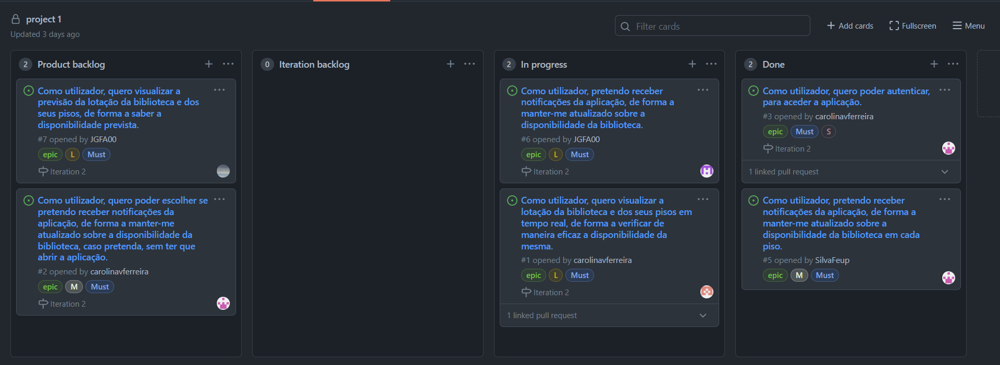

## Iteration 2

**Link para a release**: https://github.com/LEIC-ES-2021-22/3LEIC03T4/releases/tag/Iteration2

O que correu bem?

Nesta iteração conseguimos obter alguns avanços em relação ao scraping da lotação da biblioteca e colocar este processo em flutter, avanços numa versão inicial de notificações e importar o nosso projeto dentro do projeto da UNI.

O que devemos fazer diferente?

Colocando em perspetiva foi feito muito pouco trabalho e todos os elementos do grupo deviam ambicionar para uma melhor colaboração. 
O que se alcançou neste iteração não refletiu o trabalho de todos os elementos e é algo que deveríamos ter em conta.

O que ainda não resolvemos?

O proximo objetivo seria implementar a page View dentro da aplicação e colocar as notificações 100% funcionais.

Project Board:

